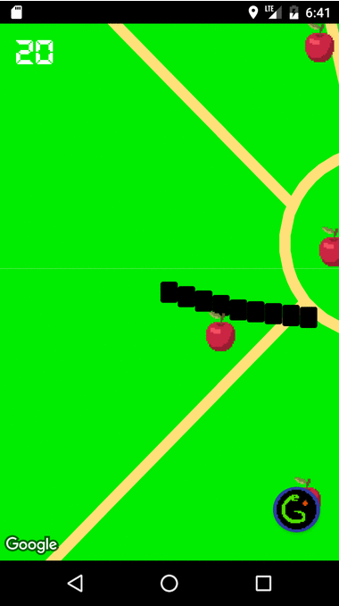

# The-Group-cmsc355-android-app

# Snake GO

## Iteration 3 Summary
Implemented new pages to display statistics and various snake facts. Updated the snakes appearance from a very basic line to look 8-bit. The red and green apples appearance too have been adjusted accordingly. There is now a splash page which greets the user upon startup. We have implemented a basic user login which takes in a users name and it is thus used to put into the highscores list is he/she is able to perform well enough. 

User Stories Completed: 
About Page on Snakes, My Score, Pixelized Snake, View My Statistics, (Loading Screen - Not Testable but Closed)

**Note: Some of the tests might not run correctly if all are run at the same time.**

## Iteration 2 Summary

**important note:** package directories in `app/src/main/java/thegroup/snakego/` have been changed to all lowercase for the new checkstyle guidelines. These changes may not show up if the repo had been pulled down from Github previously. Either rename the directories to all lowercase or remove and re-checkout the project from Github. 

Added API server: https://github.com/StevenmHernandez/the-group-cmsc355-api-server

## Iteration 1 Summary

Implemented Google Maps and Location Services. Spawning "apples" working correctly. 
Snake has a drawn length. Implemented an option menu detailing score and option
to view highscore.

User Stories Completed:
Display Menu, Random food items, Green apples, Red apples, End a Game.

Troubles:
User stories were initially based on the user being able to "see" the map, snake,
etc. We found that testing for a view on the map was not able to be done. We were 
able to adjust some of the stories to test similar stories accordingly. 

User Stories Incomplete:
Lose points when user is inactive, View statistics, loading screen, Add friends, Authentication,
presented a map.
Many of these were out of the scope for this iteration. Some were untestable. 

